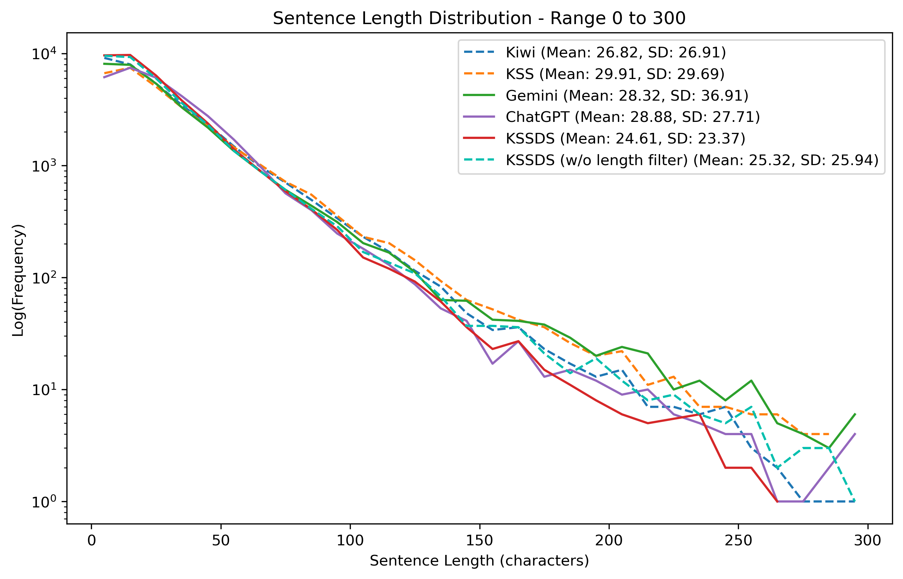
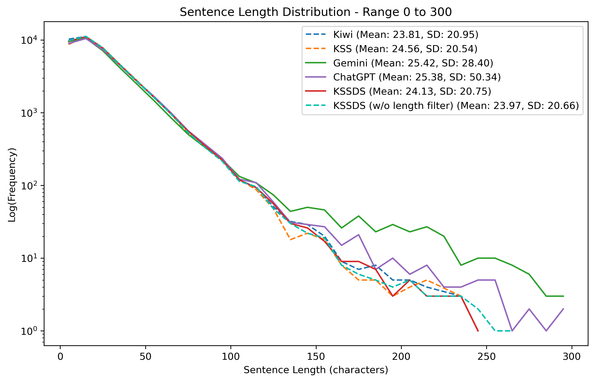

# KSSDS: Korean Sentence Splitter for Dialogue Systems

[](https://pypi.org/project/KSSDS/)
[](https://opensource.org/licenses/MIT)


### 한국어 대화 시스템 용 문장 분리기

[KSSDS](https://huggingface.co/ggomarobot/KSSDS) 는 딥러닝 기반의 한국어 문장 분리 모델입니다.

기존의 한국어 문장 분리기([KSS](https://github.com/hyunwoongko/kss), [Kiwi](https://github.com/bab2min/Kiwi) 등)는 규칙 또는 통계 기반의 모델로, 종결 어미나 구두점에 크게 의존하는 경향이 있습니다.  
이러한 특성 때문에, STT(Speech-to-Text) 모델을 통해 생성된 텍스트에서 자주 발생하는 변칙적인 사례  
(예: 구두점 생략, 어순 도치 등)에 효과적으로 대응하기 어려운 한계가 있습니다.

KSSDS는 이러한 한계를 극복하기 위해 개발된 모델로,  
트랜스포머 기반 딥러닝을 활용하여 대화 시스템에서도 안정적이고 유연한 문장 분리를 목표로 합니다.

KSSDS는 HuggingFace Hub의 `lcw99/t5-base-korean-text-summary` [모델](https://huggingface.co/lcw99/t5-base-korean-text-summary)을 기반으로 하며,  
AI HUB에서 제공하는 다양한 음성 및 텍스트 데이터를 LLM을 활용해 개별 문장으로 분리(Pseudo-Label)한 후,  
각 문장의 끝 토큰을 종결 어미로 간주하여 token classification 모델로 Fine-Tuning하여 제작되었습니다.

자세한 과정은 아래 프레젠테이션에서 확인하실 수 있습니다.  

- **🖥 Mac 사용자:** [Google Slides 보기](https://docs.google.com/presentation/d/1G7wtsq00hcrfua-SEhjDHonrAfIvW4YSDZ91PTIMGkQ/edit?usp=sharing)  
- **💻 Windows 사용자:** [PDF 보기](https://drive.google.com/file/d/1s1CDisW-7BqPOlAC0hs_jNohA31Pn7D9/view?usp=sharing) *(Windows 환경에서 Google Slides의 글꼴 및 레이아웃 문제로 인해 PDF 버전 제공)* 

## Table of Contents
1. [특징](#1-특징)
2. [성능](#2-성능)
3. [설치 및 사용 방법](#3-설치-및-사용-방법)
4. [호환성 안내](#4-호환성-안내)
5. [폴더 구조](#5-폴더-구조)
6. [License](#6-license)

## 1. 특징

KSSDS는 한국어 대화 시스템 용 문장 분리에 특화된 딥러닝 기반 모델로,  
기존의 규칙 또는 통계 기반 문장 분리기들(KSS, Kiwi 등)과는 다음과 같은 차별화된 특징을 갖추고 있습니다:

1. **구두점 의존도 감소**  
    기존 문장 분리기는 주로 종결 어미나 구두점에 의존하여 문장을 분리합니다.  
    하지만 이러한 방식은 구두점이 없는 텍스트나 구두점이 문장의 끝이 아닌 경우에는 한계를 보일 수 있습니다.  
    KSSDS는 딥러닝 모델을 기반으로 이러한 의존도를 줄이고, 구두점 유무와 관계없이 보다 자연스러운 문장 분리가 가능합니다.

2. **반복되는 단어 및 구문 처리**  
    특정 단어나 구문이 반복적으로 나타날 경우 규칙 기반 후처리를 적용하여 이를 감지하고 적절히 분리하는 기능을 제공합니다. OpenAI Whisper와 같은 STT 모델은 충분한 정보를 얻지 못할 경우, 이전에 생성된 단어나 구문을 반복적으로 출력하는 경향이 있습니다[^1]. Whisper는 텍스트 생성 시 마지막 224개의 토큰만을 참고하여 다음 단어를 예측하기 때문에[^2], 충분한 정보가 없는 경우 동일한 단어나 구문이 최대 223번 반복되는 현상이 자주 관찰됩니다.

    이러한 반복 구문은 기존의 규칙 또는 통계 기반 문장 분리기에서는 사전적 의미의 "문장"으로 간주되지 않아 처리가 어렵습니다.
    그러나 KSSDS는 문장 분리 후 추가적인 후처리 규칙을 통해 비정상적으로 긴 반복 구문을 감지하고, 이를 적절히 분리함으로써 후속 NLP 모델의 입력 길이 제한을 초과하지 않도록 최적화된 결과를 제공합니다.

3. **딥러닝 기반의 문장 분리**  
    KSSDS는 T5 모델의 Encoder를 Fine-Tuning하여 학습된 모델로, 어순 도치와 같은 복잡한 문장 구조에서도 기존의 KSS 또는 Kiwi보다 우수한 성능을 보이는 경우가 많습니다. 단순히 종결 어미에 의존하기보다는, 문장의 의미를 기반으로 한 문장 분리 방식을 제공합니다.

자세한 문장 분리 결과는 이 [Google Colab notebook](https://colab.research.google.com/drive/1gudvMJ4NDwk-V6Qh1VP2g3kL5QRicfc4?usp=sharing)에서 확인 가능합니다.

> **Note**: 
> KSSDS는 연구 목적으로 개인이 개발한 초기 모델로, 학습 데이터의 한계로 인해 일부 데이터셋에서는 성능 차이가 발생할 수 있습니다. 

> 아직 부족한 부분이 많기에 개발자분들의 많은 관심과 기여 부탁드립니다.

## 2. 성능

대화 시스템에서는 모델 입력 길이 제한으로 인해 음성 텍스트를 적절한 길이로 분리하는 것이 매우 중요합니다.  
후속 모델의 입력 길이를 초과하는 문장이 생성되면 서비스에 지장을 줄 수 있기 때문입니다.

KSSDS는 Validation 및 Test 데이터셋에서 모든 문장을 300자 이하로 분리한 유일한 모델입니다.

### Validation 데이터셋에 대한 문장 길이 분포
- **Validation Set (51시간)** - ([감정이 태깅된 자유 대화 (성인)](https://aihub.or.kr/aihubdata/data/view.do?currMenu=115&topMenu=100&dataSetSn=71631))

<p align="center">
  
</p>

#### 각 모델 별 가장 긴 문장 (Validation 데이터셋)
| 모델                      | Gemini   | ChatGPT | KSSDS (w/o length filter) | KSS    | Kiwi   | KSSDS  |
|---------------------------|:--------:|:-------:|:-------------------------:|:------:|:------:|:------:|
| 문장 길이 (공백 포함 글자 수) | 1,131    |   777   |           524             |  380   |  305   |  266   |

### Test 데이터셋에 대한 문장 길이 분포
- **Test Set (43.5 시간)** - ([전문분야 심층 인터뷰 데이터](https://www.aihub.or.kr/aihubdata/data/view.do?currMenu=115&topMenu=100&dataSetSn=71481) +  
  &nbsp;&nbsp;&nbsp;&nbsp;&nbsp;&nbsp;&nbsp;&nbsp;&nbsp;&nbsp;&nbsp;&nbsp;&nbsp;&nbsp;&nbsp;&nbsp;&nbsp;&nbsp;&nbsp;&nbsp;&nbsp;&nbsp;&nbsp;&nbsp;&nbsp;&nbsp;&nbsp;&nbsp;&nbsp;&nbsp;&nbsp;&nbsp;&nbsp;&nbsp;&nbsp;&nbsp;&nbsp;&nbsp;&nbsp;&nbsp;[방송콘텐츠 대화체 음성 인식 데이터](https://www.aihub.or.kr/aihubdata/data/view.do?dataSetSn=463) +  
  &nbsp;&nbsp;&nbsp;&nbsp;&nbsp;&nbsp;&nbsp;&nbsp;&nbsp;&nbsp;&nbsp;&nbsp;&nbsp;&nbsp;&nbsp;&nbsp;&nbsp;&nbsp;&nbsp;&nbsp;&nbsp;&nbsp;&nbsp;&nbsp;&nbsp;&nbsp;&nbsp;&nbsp;&nbsp;&nbsp;&nbsp;&nbsp;&nbsp;&nbsp;&nbsp;&nbsp;&nbsp;&nbsp;&nbsp;&nbsp;[고령자 근현대 경험 기반 스토리 구술 데이터](https://aihub.or.kr/aihubdata/data/view.do?currMenu=115&topMenu=100&dataSetSn=71703))

<p align="center">
  
</p>


#### 각 모델 별 가장 긴 문장 (Test 데이터셋)
| 모델                      | ChatGPT | Gemini  | KSS    | Kiwi   | KSSDS (w/o length filter) | KSSDS  |
|---------------------------|:-------:|:-------:|:------:|:------:|:-------------------------:|:------:|
| 문장 길이 (공백 포함 글자 수) | 8,804   |   705   |  467   |  467   |           401             |  248   |

> **참고**:  
> 추가적으로 분석된 그래프 및 데이터는 다음 Jupyter Notebook 파일에서 확인 가능합니다:  
> - [Validation 데이터셋 분석](notebooks/KSSDS%20Final%20Report%20Validation.ipynb)  
> - [Test 데이터셋 분석](notebooks/KSSDS%20Final%20Report%20TC.ipynb)

## 3. 설치 및 사용 방법

KSSDS는 GitHub에서 코드를 직접 받아 사용하는 방법과, PyPI를 통해 패키지를 설치하여 사용하는 두 가지 방법을 제공합니다.  
GitHub 설치는 추가 학습, 평가, 추론 등 모든 기능을 지원하며, PyPI 설치는 추론 작업에 적합합니다.


각각의 설치 및 사용 방법은 아래를 참고하세요.

### 3.1 GitHub에서 설치하기

GitHub 저장소에서 코드를 다운로드하면, 추가 학습, 평가, 추론 등 다양한 작업을 지원하는 스크립트를 사용할 수 있습니다.

#### 설치
1. GitHub 저장소를 클론합니다.
   ```bash
   git clone https://github.com/ggomarobot/KSSDS.git
   cd KSSDS
   ```
2. 의존성을 설치합니다.
   ```bash
   pip install -r requirements.txt    
   ```
3. 로컬 환경에 패키지 설치:
   ```bash
   pip install -e .   
   ```

#### 사용

- **추가 학습**: `./run.sh` 를 실행하여 학습을 수행합니다.
    ```bash
    ./run.sh
    ```
    - 기본적으로 `config/main_config.yaml` 파일의 설정을 따릅니다.
    - 필요한 경우 `main_config.yaml`을 수정하여 학습 데이터 경로, 모델 저장 경로, 배치 크기 등을 조정하세요.

- **평가**: `./evaluate.sh` 를 실행하여 학습된 모델의 성능을 평가합니다.
    ```bash
    ./evaluate.sh
    ```
    - 평가 설정은 `config/eval_config.yaml` 파일에서 제어할 수 있습니다.

- **추론**: `./inference.sh` 를 실행하여 문장 분리를 수행합니다.
    ```bash
    ./inference.sh
    ```
    - `config/inference_config.yaml` 파일을 사용하여 입력 데이터 경로 및 출력 형식을 설정할 수 있습니다.

### 3.2 PyPI에서 설치하기

PyPI를 통해 KSSDS 패키지를 설치하고 사용할 수 있습니다.  
PyPI 설치는 문장 분리 (inference) 작업에만 적합합니다.  
추가 학습이나 평가 기능은 지원되지 않습니다.

#### 설치

아래 명령어를 사용하여 KSSDS를 설치할 수 있습니다:

```bash
pip install KSSDS
```

#### 사용 방법

설치 후, KSSDS는 Python 코드에서 다음과 같이 사용할 수 있습니다:

```python
from KSSDS import KSSDS

# 기본 설정으로 KSSDS 모델 호출
kssds = KSSDS()

# 입력 텍스트
input_text = "안녕하세요. 오늘 날씨가 참 좋네요. 저는 산책을 나갈 예정입니다."

# 문장 분리 실행
split_sentences = kssds.split_sentences(input_text)

# 결과 출력
for idx, sentence in enumerate(split_sentences):
    print(f"{idx + 1}: {sentence}")
```
#### 출력 예시
<pre style="background-color:#F5EDED; color:white; padding:10px; border-radius:5px; font-family:monospace;">
<span style="color:#a29acb;">1: 안녕하세요.</span>
<span style="color:#c3adad;">2: 오늘 날씨가 참 좋네요.</span>
<span style="color:YellowGreen;">3: 저는 산책을 나갈 예정입니다.</span>
</pre>

### 추가 설정 옵션

`KSSDS` 클래스는 다양한 파라미터를 지원하여 사용자 맞춤형 문장 분리를 제공합니다.  
`config_path`로 YAML 설정 파일을 전달하거나, 초기화 시 직접 파라미터를 지정할 수 있습니다.

#### 주요 파라미터

| 파라미터              | 설명                                                                                     | 기본 값                          |
|-----------------------|----------------------------------------------------------------------------------------|----------------------------------|
| `config_path`         | YAML 설정 파일 경로                                                                     | `None` (기본 설정 사용)         |
| `model_path`          | HuggingFace Hub에서 불러올 모델 경로                                                     | `"ggomarobot/KSSDS"`            |
| `tokenizer_path`      | HuggingFace Hub에서 불러올 토크나이저 경로                                               | `"ggomarobot/KSSDS"`            |
| `max_repeats`         | 반복 단어 처리 시 한 문장으로 간주할 최대 반복 단어 수                                   | `60`                            |
| `detection_threshold` | 반복 단어를 감지하기 위한 최소 단어 수                                                 | `70`                            |
| `max_phrase_length` | 반복 구절을 감지하기 위한 구절 내 최대 단어 수                                               | `2`                            |

#### 사용자 정의 예시

1. **YAML 설정 파일로 초기화**:

   ```python
   kssds = KSSDS(config_path="path/to/inference_config.yaml")
   ```     

2. **파라미터 직접 전달**:
    ```python
    kssds = KSSDS(
        model_path="ggomarobot/KSSDS_NO_LF", # ablation study 용 모델
        tokenizer_path="ggomarobot/KSSDS_NO_LF",
        max_repeats=50,
        detection_threshold=100
    )
    ```
## 4. 호환성 안내

This package has been tested on the following versions:

- **Python**: 3.12.4  
- **PyYAML**: 6.0.2  
- **Transformers**: 4.42.4  
- **scikit-learn**: 1.6.0  
- **PyTorch**: 2.5.1  

Compatibility with other versions within the specified range is assumed but not guaranteed.  
If you encounter any issues with different versions, please [submit an issue](https://github.com/ggomarobot/KSSDS/issues).

## 5. 폴더 구조
```
.
├── config           # YAML configuration files for training, evaluation, and inference
├── data             # Placeholder for datasets (README inside includes Google Drive link)
├── models           # Placeholder for KSSDS models (README inside includes HF Hub links)
├── notebooks        # Jupyter notebooks for performance analysis and visualization
├── src              # Source code for the KSSDS package and utility modules
│   ├── KSSDS        # Core modules for the KSSDS package (e.g., inference, T5 encoder)
│   └── utils        # Utility modules for training, evaluation, and data processing
├── scripts          # Standalone scripts for training, evaluation, and inference pipelines
├── tests            # Unit tests for validating functionality
│
├── env.sh           # Script to set up environment variables
├── evaluate.sh      # Shell script to run model evaluation
├── inference.sh     # Shell script for inference tasks
├── requirements.txt # Required Python dependencies
├── run.sh           # Shell script to start training
└── setup.py         # Script for installing the package

```

## 6. License

This project is licensed under the [MIT License](LICENSE). You are free to use, modify, and distribute this project, provided that proper credit is given to the original author. See the [LICENSE](LICENSE) file for more details.


[^1]:[Whisper word repeat issue](https://github.com/jhj0517/Whisper-WebUI/issues/238)

[^2]: [OpenAI Whisper Discussion - Token Limit](https://github.com/openai/whisper/discussions/1824#discussioncomment-7620322)